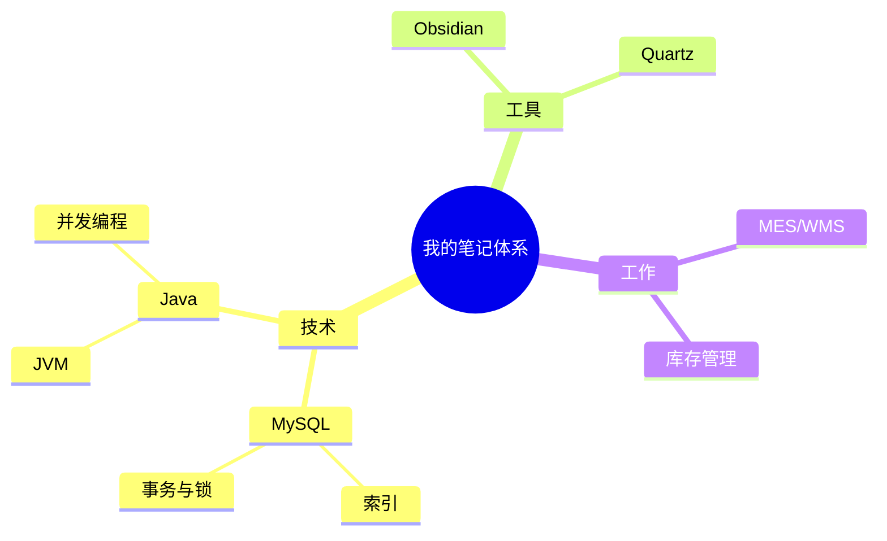

# 写作功能演示

这篇笔记演示本站支持的全部写作能力，写新笔记时照抄语法即可。

## 思维导图（Mermaid）

使用 ` ```mermaid ` 代码块即可渲染，支持流程图、时序图、甘特图和思维导图等：



其他常用图示例（流程图）：


## 画板（Excalidraw）

1. 在 Obsidian 中安装社区插件 **Excalidraw**
2. 新建画板：命令面板 → `Excalidraw: Create new drawing`，会生成一个 `.excalidraw.md` 文件
3. 像平常一样拖拽画图，保存后推送到 GitHub，本站会自动把它渲染成矢量图

在任意笔记中嵌入画板的写法：

```markdown
![[我的画板.excalidraw.md]]
```

## 视频

本地视频（把 mp4 放进 `attachments` 文件夹）：

```markdown
![[演示视频.mp4]]
```

B 站/YouTube 等在线视频，直接用 iframe 或标准 Markdown 链接语法（YouTube 链接会自动转为嵌入播放器）。

## 图片

图片统一放在 `content/attachments` 文件夹，Obsidian 中粘贴截图会自动存入：

```markdown

```

Obsidian 双链语法同样支持：

```markdown
![[screenshot.png]]
```

## 其他 Obsidian 语法

### Callout 提示框

> [!note] 提示
> 这是一个 note 类型的 callout。

> [!warning] 注意
> 这是一个 warning 类型的 callout。

> [!tip] 技巧
> 这是一个 tip 类型的 callout。

### 双向链接

用 `[[笔记名]]` 链接到其他笔记，右侧面板会自动显示反向链接，关系图谱也会随之生长。例如：[[MySQL实战45讲面试题精选]]。

### 数学公式

行内公式 $E = mc^2$，独立公式：

$$
\text{InnoDB 在 } (a, b) \text{ 上建索引后，查询 } a = 1 \text{ 可以直接走最左前缀}
$$

### 任务清单

- [x] 搭建笔记网站
- [ ] 持续写笔记
